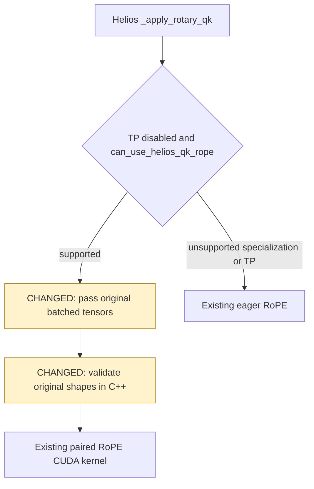

> The expanded revision and final B200 validation are in [v2](v2/README.md). The evidence below applies only to the initial commit `d72626e74d` and its narrower scope.

# Diffusion kernel cleanup: design and validation

Candidate: `d72626e74d1405ffc763b61c91fc3d164fd1d826`  
Baseline: `5916999afbc595de62dffca077fd8249634b4e74` (upstream main fetched on 2026-10-03)

The later upstream commit `5b5d72123935dc2a3fb341790796ec1a987d31ce` changes only PD disaggregation and its tests/docs; the audited diffusion sources and kernel infrastructure are unchanged.

## Design

The inventory covers 118 Python/CUDA files, 23,831 lines and 74 selection entry points. This inventory is not a claim that every kernel was changed or every model/hardware combination was validated. [The detailed audit and design notes](design-review.txt) explain which areas were retained and why.

This patch removes unreachable residual-gate implementations and redundant Python wrappers. Contiguous residual-gate still uses JIT CUDA, while transposed residuals still use the existing Triton kernel and tuning. Helios passes the original batched tensors into native validation instead of creating three flattened views. Dtype, layout, alignment, broadcast and numerical-policy restrictions that distinguish implementations remain.



Intentional error-policy change: once residual-gate or modulation selects a backend, build/launch exceptions propagate rather than permanently disabling that device/dtype after one failure. ROCm takes the eager path explicitly. The ROCm selector test uses a mocked platform flag on NVIDIA hardware; it is not an AMD validation claim.

The direct Helios launcher retains its 3D API and adds the model's 4D inputs. Invalid inputs must fail before modifying Q/K. Broader eager frequency broadcasting and unpaired Q/K shapes remain supported by the model wrapper.

## Correctness and compatibility

- Baseline: **1165 passed** for the three changed kernel suites.
- Final candidate: **1190 passed**, including 25 added parameterized cases.
- Namespace imports, model fast-path wiring and numerical quality-site suites: **180 passed, 1 skipped** on both baseline and final candidate.
- Existing suites cover CUDA graph capture, fullgraph torch.compile, FP16/BF16, offsets, broadcasts, layouts and strides.
- Added cases cover native input rejection, no Q/K writes on rejection, batched RoPE, eager broadcasting, actual residual backend selection, exception propagation/recovery, and explicit ROCm fallback selection.
- All 30 benchmark outputs have identical SHA256 bytes, shapes and strides across all four final A-B-B-A runs.
- The 12 remote candidate files were checked against the committed SHA256 manifest.
- Changed-file pre-commit hooks passed. [Raw test logs](test-logs/) and [format/lint log](pre-commit.log) are retained.
- [Retained-kernel source comparison](active-kernel-verification.json) confirms identical active Triton ASTs, CUDA device function bodies, and the residual CUDA launcher. This supplements GPU testing; it does not replace it.

No full image/video generation E2E, multi-GPU TP run, Blackwell run or AMD GPU run was performed. This patch does not change quality tiers, reductions, rounding/PTX, launch tuning, attention algorithms or quantized scale layouts.

## Performance method and results

One dedicated H200, CUDA 13.0, driver 580.105.08, PyTorch 2.13.0+cu130, Triton 3.7.1, the same container image and seed for both revisions. Warm JIT caches. No other task was run on this GPU during measurement.

[bench_cleanup.py](bench_cleanup.py) runs 30 workloads. The graph column uses the repository's CUDA graph marker with rotating cloned buffers (cold L2), 10 warmup iterations and 100 replay iterations. The eager column times 100 calls between synchronization boundaries and reports the median of three rounds. It includes Python dispatch, allocation and GPU work; it is not isolated CPU time. Helios uses the real `_apply_rotary_qk` method. Each table entry averages two process-level runs per revision in A-B-B-A order. Eager timings are noisier than graph timings.

Across all 30 final cases, graph latency changes range from **-0.41% to +0.25%** (geomean **-0.06%**). These measurements show no material graph regression on this H200; they do not certify every architecture or model. Eager latency geomean is **-6.9%**, with individual values from **-28.8% to +2.0%**. Treat the eager aggregate as descriptive microbenchmark evidence, not a model throughput claim.

The [initial runs](raw-initial/) predate restoration of the Helios broadcast-selection checks. They are retained for transparency, and are not used in the final table. Their first BF16 residual eager result was noisy (+9.5%). A [focused A-B-B-A repeat](focused-eager/) with 1000 warmup calls and seven rounds of 1000 calls measured 22.046 us baseline versus 20.687 us candidate (-6.2%). Residual source did not change between these runs. [Focused harness](bench_eager_focused.py).

| Workload | Graph baseline us | Graph candidate us | Change | Eager baseline us | Eager candidate us |
|---|---:|---:|---:|---:|---:|
| `residual/flux_text/torch.bfloat16` | 4.523 | 4.519 | -0.08% | 22.233 | 21.122 |
| `residual/flux_text/torch.float16` | 4.792 | 4.792 | -0.01% | 21.978 | 21.286 |
| `residual/flux_image/torch.bfloat16` | 19.418 | 19.415 | -0.01% | 21.881 | 21.200 |
| `residual/flux_image/torch.float16` | 19.343 | 19.375 | +0.17% | 21.810 | 20.963 |
| `residual/flux2_joint/torch.bfloat16` | 42.618 | 42.613 | -0.01% | 44.452 | 44.473 |
| `residual/flux2_joint/torch.float16` | 42.560 | 42.552 | -0.02% | 44.359 | 44.464 |
| `residual/full_gate/torch.bfloat16` | 5.448 | 5.442 | -0.10% | 18.402 | 17.838 |
| `residual/full_gate/torch.float16` | 5.458 | 5.447 | -0.20% | 18.178 | 17.973 |
| `residual/per_token/torch.bfloat16` | 6.368 | 6.378 | +0.17% | 20.271 | 19.998 |
| `residual/per_token/torch.float16` | 6.362 | 6.361 | -0.02% | 20.216 | 19.994 |
| `residual/odd_width/torch.bfloat16` | 1.869 | 1.869 | -0.03% | 21.166 | 20.368 |
| `residual/odd_width/torch.float16` | 1.869 | 1.864 | -0.28% | 24.536 | 20.615 |
| `residual/sana_transposed/torch.bfloat16` | 125.494 | 125.805 | +0.25% | 129.361 | 129.011 |
| `residual/sana_transposed/torch.float16` | 127.567 | 127.448 | -0.09% | 130.629 | 130.595 |
| `residual/transposed_small/torch.bfloat16` | 1.676 | 1.674 | -0.13% | 31.626 | 29.651 |
| `residual/transposed_small/torch.float16` | 1.675 | 1.673 | -0.07% | 31.101 | 28.973 |
| `residual/transposed_medium/torch.bfloat16` | 2.338 | 2.332 | -0.25% | 32.467 | 30.438 |
| `residual/transposed_medium/torch.float16` | 2.316 | 2.317 | +0.03% | 32.634 | 30.677 |
| `modulate/(1, 512, 3072)` | 4.869 | 4.860 | -0.18% | 14.747 | 12.084 |
| `modulate/(1, 4096, 3072)` | 14.993 | 14.967 | -0.17% | 15.975 | 16.290 |
| `modulate/(2, 1024, 3072)` | 9.112 | 9.110 | -0.03% | 15.213 | 12.167 |
| `usp/(4, 7936, 1, 14, 128)` | 64.758 | 64.766 | +0.01% | 66.751 | 66.776 |
| `usp/(2, 64, 3, 4, 64)` | 2.503 | 2.492 | -0.41% | 10.580 | 10.069 |
| `usp/(4, 33, 2, 4, 100)` | 3.005 | 2.994 | -0.37% | 10.611 | 9.963 |
| `helios/(1, 2160, 40, 128)` | 29.005 | 29.017 | +0.04% | 29.746 | 29.805 |
| `helios/(1, 8640, 40, 128)` | 110.000 | 110.003 | +0.00% | 111.747 | 111.828 |
| `helios/(2, 17, 8, 128)` | 2.013 | 2.010 | -0.16% | 12.213 | 8.695 |
| `cat_pad/8/6/6` | 2.306 | 2.308 | +0.08% | 16.965 | 12.595 |
| `cat_pad/512/30/52` | 6.556 | 6.559 | +0.06% | 14.884 | 12.808 |
| `cat_pad/1024/30/52` | 11.102 | 11.097 | -0.05% | 15.001 | 12.860 |

## Reproduce

Run each command from its source checkout, with this evidence checkout available as `$EVIDENCE`:

```bash
export CUDA_VISIBLE_DEVICES=0 MAX_JOBS=8
export PYTHONPATH="$PWD/python"
python3 -m pytest -q \
  test/registered/kernels/ops/diffusion/test_helios_qk_rope.py \
  test/registered/kernels/ops/diffusion/test_modulate.py \
  test/registered/kernels/ops/diffusion/test_layout.py
python3 -m pytest -q \
  test/registered/unit/kernels/test_kernels_namespace.py \
  test/registered/kernels/ops/diffusion/test_model_fast_paths.py \
  test/registered/kernels/ops/diffusion/test_sites.py
ARM=baseline OUTPUT=baseline.json python3 "$EVIDENCE/bench_cleanup.py"
# Repeat from the candidate checkout with ARM=candidate, then candidate and baseline again.
python3 "$EVIDENCE/verify_active_kernels.py" "$PWD"
```

The evidence branch contains only review artifacts; it is not part of the implementation PR diff.
