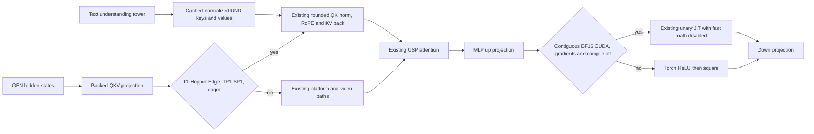

# Cosmos3 Edge Hopper fusion review

Reviewed candidate `18f1417a8b189fcb80b38d6ca3b487ecca89f39d` against `993d1fccbaafe3e79d91567d2fc1d665cc94fa50`. Native repeated validation and final media/cleanup auditing are tracked separately in `final-evidence.json`.

The exhaustive five-path corpus scan covered 32,639 review episodes and matched three Cosmos inline threads from PR24994. The widened diffusion/kernel scan matched 164 threads across 82 PRs, with 273 human comments. The non-inline scan matched 89 conversations and 718 human comments. Relevant returned episodes were read. Applied precedents include preserving USP/backend compatibility and avoiding unnecessary parallel wrappers (24994), reusing JIT dispatch infrastructure (14302), checking reduction/epsilon placement (20673), and requiring both kernel tests and native accuracy/performance evidence for activation changes (21321, 20882, 21145). The latter two explicitly rejected runtime activation PRs without tests and benchmarks.

The actual Cosmos Edge support diff31590 was reviewed for architecture, separate UND key normalization and generation-cache behavior. Prior BBuf changes34932 and36571 establish the rounded T1 cache and the Hopper Nano fast path; their implementations are reused. Closed PR34618's complete BCG diff was read. The current Cosmos custom denoising stage does not integrate a BCG runner, and both native Edge probes explicitly disable it. No BCG speedup is claimed.

The T1 change admits the validated 2048-wide dense Edge shape to the existing one-GPU Hopper path. Larger dense configurations, TP/SP configurations and compiled paths retain the existing policy. Blackwell behavior is unchanged. The existing capability check still validates head/rope dimensions, dtypes and packed-KV eligibility. Rounded cache values are converted to BF16 once, preserving the eager per-layer casts. The fused routine mutates request-owned Q/K views and allocates packed output. V and cached UND K/V remain unchanged; the Edge-specific normalized UND keys are not normalized again.

The first ReLU2 experiment exposed 511 finite BF16 mismatches from fast-math flushing subnormal products to zero. That candidate never reached native combined benchmarking. The final patch exposes the existing activation compiler's `fast_math=False` option through the unary wrapper and uses it only for the Cosmos BF16 eager path. Existing callers retain `fast_math=True`. No CUDA implementation or checkpoint parameter changes. All 65,280 finite BF16 encodings, including signed zero and subnormal results, match the Torch ReLU-then-square chain. The same test replays a CUDA graph after negating the input. Production image/video activation shapes and input preservation are tested. Grad-enabled, compiled, non-CUDA and other-dtype model calls retain Torch.

Validation completed before native combined benchmarking: 145 Cosmos/kernel tests and 46 subtests passed; 85 existing unary activation compatibility tests passed. All five changed files passed pre-commit, including registered-test validation. The marker benchmark uses the committed wrappers, rotating inputs and median timing; it includes normal output allocations. QKV inputs are request-owned strided GQA views. The benchmark's in-place Q/K behavior matches the production ownership contract.

Profile analysis uses CUDA launch correlations to align a complete positive/negative CFG iteration with GPU execution. Host model-call timestamps alone crossed a running video kernel and were rejected. Every retained slice has zero GPU boundary crossings and contains only the matching CPU iteration, preserving source attribution. Profiler wall times are excluded from E2E claims. Automated FP8 suggestions for the BF16 GEMMs are not adopted.

No blocking source issue was found for the tested finite-activation BF16 H200 inference workloads. Other dense Cosmos checkpoint performance is not inferred from Edge measurements. The native T2I image contains the blue cloth/workbench but no visible robot, equally in baseline and candidate; output comparison establishes preservation of the native result, not perfect prompt adherence.
