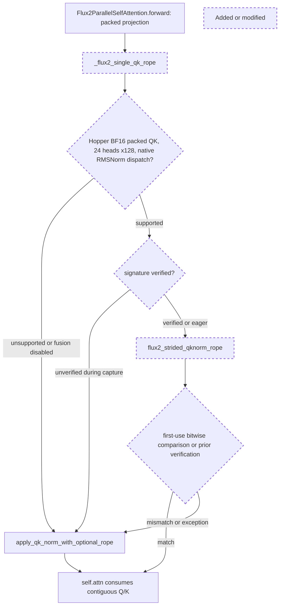

The candidate fuses only the single-stream packed Q/K path in Flux2ParallelSelfAttention.forward. It preserves native tiled RMSNorm reduction, BF16 intermediate rounding and FlashInfer interleaved RoPE cosine-FMA ordering, reading adjacent pairs in registers.

The single-stream attention projection supplies noncontiguous Q/K slices. The new helper checks the hardware, layout, live RMSNorm dispatch and existing environment flag before launching the fused kernel. It verifies each signature outside graph capture, then passes contiguous Q/K to the existing attention. Unsupported or rejected paths call the original shared helper. V/MLP storage is untouched.

Historical review sweep covered all32639 threads: one exact-path thread (PR21440) asks that shared QK/RoPE logic remain centralized. The new model-specific helper calls that shared reference rather than duplicating platform fallback dispatch; the arithmetic implementation lives in kernels/ops. A separate exhaustive risk sweep matched1349 threads across680 PRs. Recurring applicable review concerns are reproducible hardware-specific benchmarks, numerical/graph correctness on changed inputs, and separating unprofiled performance from profiler evidence.

Source checks: RMSNorm.forward_cuda selects the native tiled Triton kernel for D128; deterministic/native dispatch falls back. Explicit Hopper guard avoids assuming equality on another architecture. The signed-zero failure observed in v1 has a bitwise regression test; v2/v3 pass all five tests plus nine shape/magnitude subtests. Eight changed-input/weight/cache replays test reuse of a verified signature. Contiguous singleton views preserve the original in-place behavior. Complex-frequency/ROCm fallback remains in the shared reference. No blocker found after these checks; residual risk is future native Triton/FlashInfer dispatch changes, mitigated by signature verification and automatic fallback. Other hardware takes the native path.

The first fixed v3 group contains a slow candidate client observation (7.45s), so it is not omitted or used as a positive performance result. Native request warmup defaults to one denoising step (server_args/server_args.py), not fifty. A separately labelled fixed two-group comparison uses --warmup-steps=50 on both arms to measure full-request-warmed latency. All original groups remain published.
