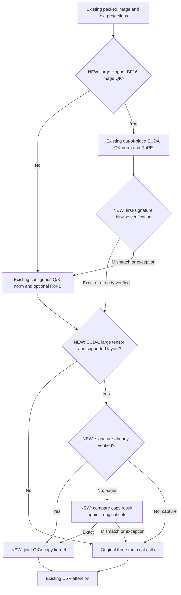

# Joy Image Edit joint QKV copy review

The change preserves the model's Q/K normalization and RoPE arithmetic. For the measured large Hopper BF16 image branch, it reuses the existing out-of-place CUDA operation to read packed Q/K directly and produce contiguous outputs, removing two preliminary copies. A separate pure-copy kernel then packs image-first Q/K/V, accepting contiguous normalized Q/K and strided V. Each fast path uses a first-signature integer-view comparison against the original operation. Small inputs, unsupported platforms/layouts, gradients, compile, unverified graph capture, exceptions and bit mismatches retain native execution.

Corpus coverage: all 32,639 episodes scanned for all five touched paths; no exact-path historical match. A risk-keyword sweep matched 4,828 episodes across 2,071 PRs. A related diffusion normalization-path sweep matched 26 episodes across 13 PRs. Read the aggregate and ranked threads, including non-inline discussions in #19876 and #20810 about changed-shape CUDA-graph validation and complete image workloads. Related #13662/#20816 reviews emphasize backend-specific imports and preserving CPU fallback; #17537 discourages per-layer warnings. The implementation reuses BitExactFusionGate and the public kernel facade.

Findings resolved: first microbenchmarks showed eager regressions for small inputs, so the model now retains native cats below 32 MiB per image tensor; the 32 MiB boundary and smaller fallback cases were measured. The first implementation eagerly imported Triton through facade attribute access; commit 38b0577f29820a719e48154b40f8ed32480f56f9 changes this to facade-module import and checks CUDA/HIP/compile eligibility first. No CPU or other accelerator executes the new Triton path. Registered tests cover packed V, batches, odd widths/tokens, FP16/BF16 signed-zero/subnormal/infinity/NaN bit patterns, non-overlapping output views, changing-input graph replay, gradient fallback, forced mismatch/exception and unverified capture.

Prior-art source review: BBuf #34617 Hunyuan QKV/RoPE packing and #34616 guarded lossless integration were reviewed earlier in this campaign. The existing varlen segmented pack forces contiguous inputs and includes index selection; Hunyuan pack also changes RoPE math. Neither is a drop-in replacement for Joy's pure image-first concatenation, whose actual text branch has no RoPE. Existing #37903 out-of-place QK/RoPE source was inspected; the later combined candidate reuses that operation for the image branch. #37903 is KevinMi's upstream work, not a BBuf PR.

The copy-only version 3b00154d completed two independent full-warm ABBA groups. Its first group reached only about 1.43% worker and 1.35% saved-client improvement; it is not accepted as the final optimization. The second group and all v2 results remain in the evidence. The initial single request improved worker time by about 1.1% and is also retained as non-qualifying. Native BCG logs say disabled, so standalone graph kernel measurements must never be called model BCG gains. Peak memory and every original result row, including client outliers, must be disclosed. Weight cleanup remains pending until all model evidence is complete.

## Out-of-place follow-up, 4811f4d5

The baseline trace's 160 Q/K copy kernels motivate removing the two image copies per block. Reviewed the existing qknorm_rope_jit.py facade and the CUDA QKNormRopeOutOfPlaceKernel / shared fused_qknorm_rope_warp template: out-of-place selects separate output pointers/strides and retains the same reduction, normalization and interleaved RoPE arithmetic. It leaves Q/K/V inputs untouched, which makes exception fallback safe even after partial output writes. The patch does not opt into in-place mutation of packed projections and does not change the text branch (which has no RoPE in this workload).

Re-ran the exhaustive corpus sweep over all six final paths: 32,639 threads scanned, zero exact-path matches. The related layernorm/out-of-place sweep matched one full human thread, PR #14302 discussion_r2653085681. DarkSharpness treats allow_inplace as a performance hint and explicitly permits a faster out-of-place implementation without redundant copy_. The previously reviewed broad risk sweep and graph/backend discussions still apply. The implementation uses the public kernel facade, preserves the existing environment disable switch, and is limited to the measured Hopper BF16 packed layout with at least 32 MiB per image Q/K tensor. The new tests exercise changed inputs, weights and cache under graph replay, production/batch-two shapes, signed zeros, native non-Hopper/compile/small-shape paths, explicit disable, forced mismatch, and partial-output exception recovery.

The combined candidate passed 8 GPU tests plus 8 subtests on H200, changed-file pre-commit and documentation build/link validation. Native lossless/high saved images are byte-identical. The final native profile confirms 1,268→1,108 kernels with the two image Q/K copies per block removed; the 80 text copies and two FP32 concatenations remain. Focused NCU and source/PM reports are complete. Native model BCG remains explicitly disabled. However, the combined oneshot second group fails the saved-client threshold because of a retained 16.08 s outlier, and the predeclared persistent protocol also exposes candidate request tails of up to 16.99 s despite a ~13.8 s worker duration. These are potential regressions requiring diagnosis, not results to discard. Separate diagnostic worktrees time save/peak collective/empty-cache/reporting and Python GC. No PR admission or weight cleanup is authorized by source review alone; final measured acceptance remains pending.

## Completed request-tail diagnosis and final acceptance

The timing-only baseline diagnostic identifies a 1.760153 s output-rank empty_cache delay, while candidate's twelve diagnostic requests do not reproduce its earlier tails. The attribution of those earlier individual candidate outliers remains an inference. All diagnostic requests are excluded from qualification; all failed worker-save comparisons remain in the audit.

Both measured source revisions then use the native client-save configuration (return_file_paths_only=False, save_output=True), keeping generation, pixel transport, PNG saving and reporting inside the saved-client timers. Two fixed ABBA groups each retain twenty measured requests and four saved warmups. Group 1 improves worker/native saved-client/outer wall by 3.1635% / 3.1324% / 3.1201%; group 2 improves them by 3.2721% / 3.2518% / 3.2484%. Neither production revision changes allocator or GC functions. This supports the explicitly scoped native client-save result, not a reliable default worker-save client speedup.

The final audit contains 141 output records, preserving all prior revisions and disabled-BCG probes. The actual lossless/high comparison images were visually reviewed. The campaign-owned Joy checkpoint was subsequently removed and audited to zero remaining files, weight files and bytes. The model cycle now qualifies for publication with its configuration limits disclosed.
