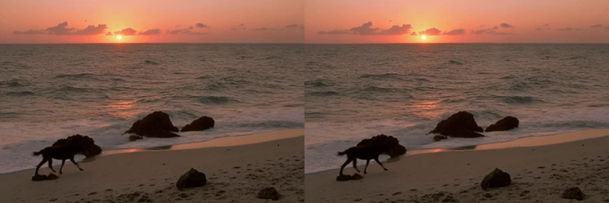

# LTX-2.3 QK norm / split RoPE on H200

Baseline `0bc074db83286449b96198eb340dacdf89041650`; candidate `8b4fed70dfec11e1d4483527903cb2ecdf54251b`. The production change is SM90-only.
The candidate originated in KDA host_runtime with Codex CLI 0.153.4 and Kimi K3 high.

Three kernel repeats: 2.5814x / 2.5932x / 2.6146x geometric-mean speedup over five
workloads; minimum observed ratio 1.9177x. See `kernel-benchmarks.json` and
`kernel-workloads.json` for every case.

Two fresh-process A-B-B-A groups measure full saved requests after request warmup:
43.735 -> 43.285 s and 43.765 -> 43.260 s, reductions of 1.03% and 1.15%.
Model loading and separately captured profile runs are excluded. The aggregate
is 43.7500 -> 43.2725 s, a 1.09% latency reduction.

These E2E measurements use **the same deterministic audio-decode context in both
arms**. The original baseline's default audio decode was not self-reproducible.
`repro/sitecustomize.py` disables cuDNN/matmul TF32 and cuDNN benchmarking and enables
cuDNN deterministic only during audio VAE decode/vocoder calls, then restores the
settings. This is a validation helper, not a production code change. The reported
timing and output identity are conditional on this setting. All eight MP4s are
byte-identical. Every decoded frame has SSIM 1 and PSNR infinity.

The preview puts baseline on the left and candidate on the right:

Reproduce one saved request with `bash repro/run-one.sh` after setting its required
environment variables. Run fresh processes in baseline/candidate/candidate/baseline
order twice on the same idle H200, using a distinct output directory each time.
Both checkouts must use the same checkpoint revision, dependencies and helper.
Use SGLang's logged saved-request latency, not shell wall time including model load.
The original command and workload settings are encoded in the helper and request JSON.

Final code preparation changed only comments, formatting and include order relative
to the timed CUDA overlay; the Python dispatch is byte-identical. The final source
passed 14 tests on H200, with 4 architecture skips; graph replay, fullgraph compile,
unaligned/odd-stride/mixed paths and empty Q/K sides are covered. `tests.log`,
`pre-commit.log`, `source-equivalence.json`, and the manual checks retain the evidence.
The separate real-model shadow check verifies 1,340 Q/K calls against original CUDA.
`profile-summary.json` reports CUDA duration sums, not E2E critical-path fractions.

`provenance.json` retains source/submission/transcript hashes. Full transcripts are
retained in the private experiment archive; credentials and machine access details
are not part of this public packet.
