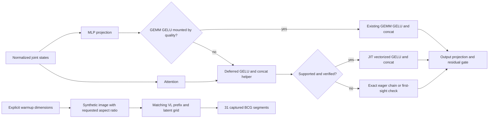

# LongCat GELU+cat and Edit-Turbo BCG review

Reviewed combined candidate `10410a20b6d2716c1489a3132dc79c775dc297bb` against baseline `993d1fccbaafe3e79d91567d2fc1d665cc94fa50`. The kernel, wrapper and marker benchmark are unchanged from the GPU-tested/NCU-profiled `a7d440f640` implementation. Latest main `3a64faa1f22a86abd37a759c84267d929e820d5b` has no changes to the affected diffusion runtime or kernels.

## Historical review evidence

Exact new kernel paths had no corpus matches after the directory migration. The required widened scan examined 32,639 episodes and matched 641 inline threads across 254 PRs. The non-inline scan matched 1,776 conversations. A second sweep over all 12 final changed paths and their legacy directories matched 512 inline threads across 184 PRs; the returned relevant review episodes were read.

Maintainer concerns applied here include runtime device/SM/stream selection (#7278, #25855, #19880), explicit shape contracts (#25751), mutation semantics (#20673), marker timing and allocation placement (#21531, #6837), native A/B evidence with identical settings (#19225), BCG prompt/shape semantics (#19876), and preserving CFG through warmup transport (#23198). The native LongCat Edit support diff #35829 was read in full, including conditioning construction, position IDs, SP padding and tests. Recent lossless normalization and rounding approaches in #38530 and #38396 informed the exactness gate; their changes are not duplicated.

## Source conclusions

The fused output is newly allocated, contiguous and request-owned. Inputs are not mutated, and no output or workspace pointer is cached. Python guards check BF16, device, contiguity, leading dimensions, positive vector-aligned widths, 16-byte alignment and the indexing limit. C++ TensorMatcher validation checks the launch contract independently. Runtime device properties and LaunchKernel preserve device and stream selection. All finite BF16 encodings match the current Torch arithmetic, including signed zero.

The first-sight gate compares against the live eager operation outside graph capture. Exceptions or numerical mismatch disable the fast path. Grad-enabled, compile and unsupported calls use eager. The existing quality-mounted projection GELU branch retains its original concatenation. Deferring elementwise GELU until after attention changes no input to attention and introduces no shared buffer mutation.

The synthetic image hook runs only when warmup resolutions are explicit. It preserves request sampling and CFG fields, while making the existing image-derived resolution calculation produce the requested non-square grid. Real input images are untouched. LongCat's unmasked joint attention retains the exact VL prefix plus 512-token body; arbitrary bucket padding would alter the computation. Both pipeline-config and model-ID allowlists must match, so only Edit-Turbo gains BCG admission here.

## Validation and limitations

Six kernel tests passed, covering all 65,280 finite BF16 encodings, production and smaller shapes, input preservation, changed-input graph replay and invalid layouts. Seven LongCat model/dispatch tests passed. Forty-six config/padding tests plus seven subtests passed. All changed files passed pre-commit, including test registry and script-entry validation.

The complete-step native profile joins baseline aten operators to kernels via External id: 40 GELU/concat kernels take 5.7457 ms, versus 20 fused kernels taking 3.2138 ms in combined eager. Total step kernels fall from 699 to 679. The BCG trace proves actual replay with 248 cudaGraphLaunch calls across eight steps. Every selected step has zero boundary-crossing kernels. Paired NCU full/source reports confirm reduced memory traffic and identify the remaining MLP load and arithmetic stalls. A faster approximate-tanh experiment changed 60 finite BF16 results and was rejected.

Two original-eager versus combined-BCG ABBA groups show worker reductions of 2.46% and 2.65%, and saved-client reductions of 2.89% and 2.62%. Kernel-only E2E did not qualify. Combined eager has stable denoise gains but saved-client outliers in both groups; no repeated eager saved-request E2E claim is made. All raw rows are retained. BCG uses additional reserved memory. High+BCG is explicitly rejected by the existing runtime because request-scoped quality fusions differ from lossless warmup graphs; these rows are excluded from performance evidence.

No blocking source issue was found within the tested H200, native BF16/lossless scope. Other GPU architectures and ordinary Edit model weights are not represented by these Turbo E2E numbers. The public evidence and weight-cleanup audit are checked separately before submission.
