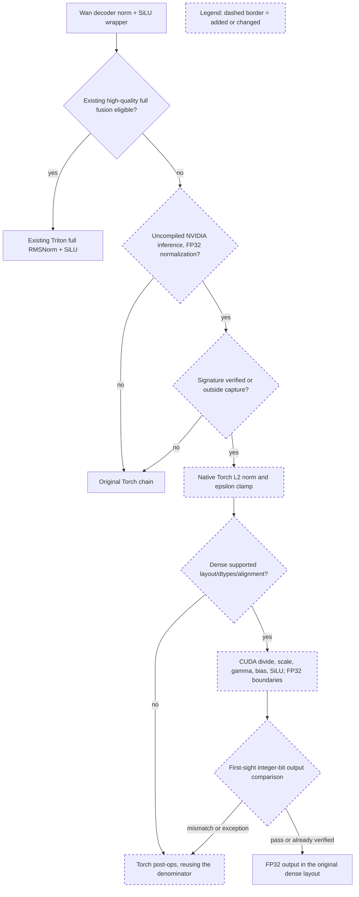

# LongLive 2 lossless Wan VAE normalization review

Candidate `be05e7e6c24252db11458621f2d06f3969be08d1` preserves the native Torch L2 norm and clamp, then replaces five FP32 pointwise passes with one CUDA JIT kernel. The existing quality-gated full RMSNorm+SiLU implementation remains ahead of this lossless fallback. Final native validation and output audit passed. The independent I2V workload qualifies in all four ABBA groups; T2V client E2E remains unqualified due to retained post-save outliers.

The full 32,639-episode corpus was swept for all seven touched paths. Exact paths have no matches because they postdate the corpus snapshot. Widening to VAE and former JIT paths plus dtype/norm/copy/CUDA terms matched 350 inline threads across 116 PRs, 619 human comments; the top 12 rendered threads were read. A VAE-only sweep matched 29 threads across nine PRs; its top ten were read. A conversation sweep matched 108 PR conversations and 700 human comments; its top ten were read, then #25920 was drilled down. Docs widening matched 72 threads across 35 PRs; the top four were read.

Recurring review requirements were a stable explicit reference and integrated-path tests (#22488), application-level fallback before unsupported kernel assertions (#19059), common VAE mechanisms instead of duplicated model implementations (#16510/#20757), and exact rounding boundaries rather than relaxed tolerances (#19775/#25920). JIT template/loader utilities are reused. The new operator has a unique global custom-op name. The shared VAE wrapper is used instead of a LongLive-only copy.

Actual prior Wan source diffs reviewed: #35981 full row-flattening diff; #33546 norm kernel, Wan wrapper/platform and test hunks (the unrelated FLUX2 gate refactor was not read); open #38650 norm tiling and Python norm wrapper hunks. #38650 remains open at 0e2a6f4dffd4d00575b571da07385bd9162f6d1a and changes conv-bias epilogues plus the quality-gated full norm; this candidate changes the lossless post-only chain. Native Torch SiLU source was verified at the installed Torch commit cf30153c4c131c8164ee7798e5022d810682e2cb. Kernel math uses explicit FP32 add/multiply/divide, expf, and no fast math or FMA contraction.

The original full trace attributes 464 norm/SiLU scopes to 3248 kernels and 312.473870 ms for T2V (690.823068 ms for I2V). Autocast gives BF16 input and gamma but an FP32 denominator and output; casting intermediates back to BF16 would change the reference. The initial candidate T2V profile has 434 fused calls (415 channels-last, 19 NCDHW), 1894 total attributed kernels and 126.260507 ms. Thirty scopes remain on fallback; their shapes alone do not reveal which layout/type guard rejected them. Review caught a duplicate norm on unsupported fallback and fixed it to reuse the denominator. Final T2V profiles attribute 1834 kernels /124.122471ms to the same 464 scopes; final I2V attributes1834 /275.255048ms, versus baseline3248 /690.823068ms. Both final traces contain434 fused calls and30 fallback scopes. First-sight validation reference work is included in profile and saved-request timing.

Standalone H200 tests covered random BF16/FP32 input and affine tensors, both dense layouts, all 65,280 finite BF16 bit patterns and FP32 SiLU/subnormal boundaries with integer-bit equality. Integrated tests cover changed-input and changed-affine CUDA replay, unverified capture, deliberate mismatch and permanent fallback, unsupported layout and BF16-without-autocast behavior, compile guard and gradient propagation through Torch. Follow-up tests add nonintegral sqrt(channel) scales, zero norms, and ensure unsupported fallback does not repeat normalization. New kernel code and dispatcher views do not alter input storage. All new paths step aside under compile; standalone CUDA replay is tested, while native LongLive 2 BCG is explicitly disabled.

The native helper actually warms up 960x928x29 frames with two of four denoise steps for both modes; all arms use the same helper and parameters. Requested saved-output workloads are T2V 832x480x61 and I2V 960x928x61, four steps, seed 42, single H200, resident unquantized inference. The first candidate client outlier (5.93s vs 2.245720s worker) is retained. Final qualification uses fixed additional r3/r4 ABBA groups on the reviewed source, with all earlier results reported. Peak memory increase and complete lossless/high output comparisons must be included in the PR. Mint build validation and broken-link checks passed with Node22.

Final validation:9 pytest cases plus16 subtests passed; all seven changed files passed pre-commit and both Mint checks passed. The automatic performance mode resolves all component CPU offload flags and DiT layerwise offload to false in both arms. Native I2V requests960x928 but source-aspect handling produces1152x768; ffprobe verified the same geometry in all24 I2V artifacts. Its native supported-resolution advisory is retained in the logs. The helper warmup geometry is unchanged across arms.

The original all-workloads qualification field remains false in final-evidence.json. A separate qualification-review.json identifies I2V alone as qualified: worker means improve6.07%,5.85%,5.53%,5.88% across r1-r4; all four client means clear1.5%. Final r3 gives representative client5.98->5.665s,5.27%. Final r4 baselineA1 client7.08s inflates that group's gain, so12.54% is not quoted as representative. T2V r1B1/r4B2 post-save delays are disclosed, with no T2V client E2E speed claim. No sample is removed. Final peak reserved memory increases59.642578125->61.01953125GiB.

The decoded output audit covers56 records,48 valid videos,42 byte-exact lossless videos and six high videos. All are61frames/24fps/no audio; both lossless before/after contact sheets were visually inspected. High T2V SSIM mean/min0.955287854/0.945272346,PSNRmean/min36.504008/35.367710dB; high I2V SSIM0.980385085/0.977650832,PSNR43.420775/42.731333dB. Baseline, initial candidate and final candidate high videos are byte-identical within each mode. Eight actual BCG probes are invalid because the native configs explicitly disable BCG.

NCU reports show five post-op kernels1599.136us ->one315.104us, DRAMtraffic3,773,071,872->591,149,056B,84.33% reduction. The fused launch has30registers,no spills,70.62% active warps and38.99% combinedDRAMthroughput, with denominator-load long-scoreboard and SiLU dependency/MIO samples. REPORT.md includes source and PM evidence plus one deferred channel-specialization experiment. Final full-trace three-table triage was manually corrected: FlashAttnFwdSm90 is attention,cuDNN fprop is convolution,and nvjet here is BF16 rather than the tool's unrelated FP8 suggestion.

A fixed diagnostic ABBA reproduced the same post-save delay on baseline A1 (client6.09s, worker2.392123s); candidate diagnostic clients were2.57s and2.57s, baselineA2 2.70s. All four diagnostic MP4s remain exact. Active-thread py-spy samples and GC callbacks do not identify the cause. These runs are diagnostic only and do not change the T2V qualification decision. The first sampler-child attempt ended with OS error10 after successful native output and is retained.
