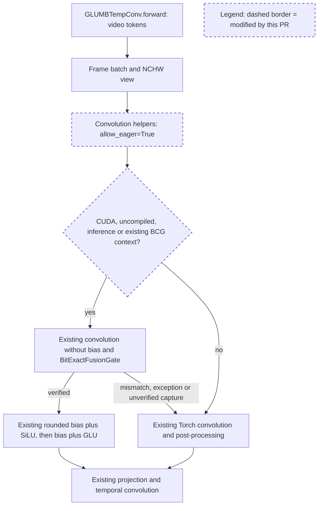

# SANA Video eager convolution fusion review

Candidate `275113434ffe34412f807514399ba00ef70fa38e` against `993d1fccbaafe3e79d91567d2fc1d665cc94fa50` enables the existing rounded convolution post-processing in the native video's default-stream inference. It does not change the CUDA/Triton implementation or LayerNorm policy. Native repeated validation is tracked separately.

The video block now opts into the shared helpers on the default inference stream. The helpers retain their original capability and exactness checks before dispatching the existing kernels; unsupported paths and failed verification use the reference. Image callers keep the default opt-out.

All four touched paths were swept against the full 32,639-episode review corpus; none matched because these model paths postdate the refresh. Widening to diffusion models and graph/convolution risk terms returned 18 inline threads across two PRs, all read. The conversation sweep returned 916 PRs and 3,880 human comments; the 15 highest-ranked rendered conversations were read. Applied precedents are shared helpers rather than duplicated model dispatch (18306/19516), native same-argument perf dumps and generated output evidence (19225/20922), and avoiding extra copies (18179).

The actual 374-line #34928 convolution-post-processing diff and 269-line #35961 SANA Video BCG reuse diff were read in full. Their existing first-sight gate and rounded arithmetic are reused. The #34015 body explains why the image model excludes eager LayerNorm fusion: small image shapes are CPU-launch bound. This patch leaves that policy alone. The new native video profile is more than 99% GPU busy: 80 convolution-bias additions take 97.77 ms per complete CFG iteration, before activation/multiply costs.

The shared convolution helpers gain an explicit keyword defaulting to false. Only SANA Video opts in, while eager gradient-enabled calls stay on Torch. Compile and non-CUDA guards remain ahead of any CUDA stream access. Existing capability checks preserve dtype/layout handling. First-sight mismatches and exceptions retain the eager reference; unverified capture does not run a host synchronization. No per-request tensor cache, checkpoint mutation, approximate attention or sampling change is added.

The full native `[1,21,30,52,2240]` GLUMB temporal-convolution chain matches its original reference on H200, verifies both fusion gates, and preserves input storage contents. A changed-input graph replay matches the reference. Separate tests cover the image helper's default-stream policy, permanent mismatch fallback and CUDA gradient propagation through the Torch path. Five new tests plus seven existing SANA Video tests passed; all four changed files passed pre-commit and registry validation.

The committed marker benchmark includes actual pointwise/depthwise convolutions and output allocations. Two saved-output native eager ABBA groups reduce client E2E by 12.67% and 12.54%; BCG is unchanged. Eager and BCG profiles use third-to-fifth model/graph calls for one complete second CFG iteration, joined by CUDA launch correlations, with zero GPU boundary crossings. Both BCG traces contain eight single-segment graph launches and the slices contain two, establishing actual replay.

No blocking source issue was found for the tested H200 inference path. All 22 valid lossless videos are byte-identical and all 81 decoded frames match. High eager passes the existing video thresholds (minimum SSIM 0.923584, PSNR 29.9297 dB); high BCG is explicitly rejected by the existing request-scoped attention guard and excluded from performance claims. The 130-file cache, including five weights and 14,004,704,105 bytes, was removed with zero residuals.

The documentation follow-up changes only the SANA-Video coverage row to state that GLUMB post-processing runs in eager and BCG while LayerNorm and residual-gate policy stays BCG-only. Its exact path has no corpus match; widening to docs and diffusion documentation found four threads, one PR and nine comments, with the top three read. The relevant principle is retaining model-specific behavior and keeping existing documentation aligned. Latest main 9cc7da2ab0 has no changes in the diffusion runtime or the touched paths relative to the benchmark base.
