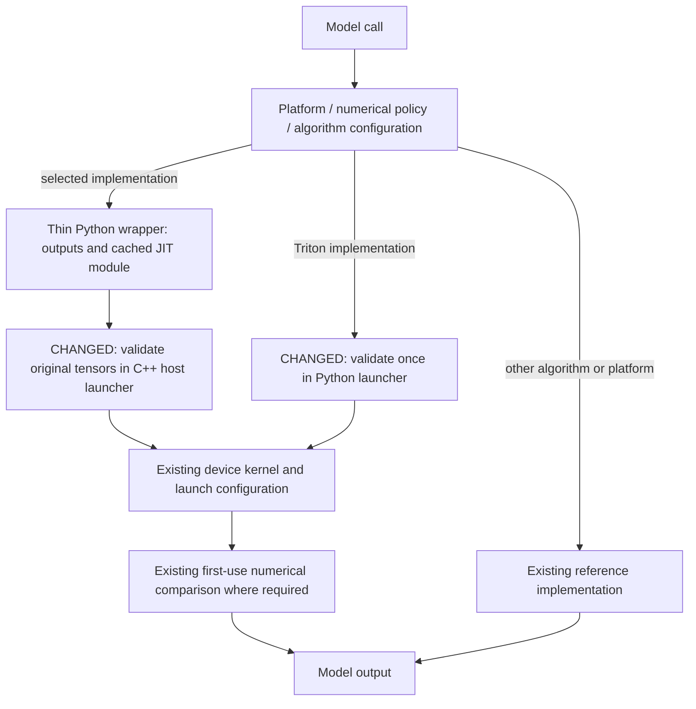

# Diffusion kernel launcher cleanup — expanded review

This revision separates implementation selection from argument validation across RoPE, activation, normalization, conditioning, layout and VDN launchers. It removes 17 tensor capability scans and narrows five others to dtype/dimension/device configuration. Original tensors reach native launchers before flattening can erase their shape relationships. Active device arithmetic and launch tuning remain unchanged; Helios also instantiates its existing arithmetic for FP32.

## Historical review synthesis

The exhaustive review scan covered 40,110 episodes and matched 105 inline threads from 43 PRs (174 human comments). The relevant recurring advice is to select fixed model specializations once, keep variants explicit, reuse existing kernel interfaces, avoid cached tensor workspaces that change aliasing, and measure CUDA Graph as well as eager behavior. A separate whole-corpus conversation scan matched 1,216 conversations / 5,323 comments, reinforcing that green unrelated CI does not establish activation of a changed fast path, and that numerical/performance comparisons need pinned inputs and a live reference. These reviews are historical evidence, not authority on today's backend. In particular, older advice to flatten tensors in Python predates the current requirement to validate original batch/sequence relationships.

## Implementation decisions

- Helios, SANA FP64 interleaved RoPE, LTX-2.5 decoder RoPE, GELU+cat and VDN delta factors pass original tensor dimensions into C++ validation. CUDA `TensorMatcher` or host checks validate dtype, device, shape, contiguity and vector alignment.
- Helios uses the paired CUDA implementation for its normal NVIDIA/non-TP attention path. FP32 uses the same multiply/add sequence as FP16/BF16. The attention module creates paired Q/K with the same heads and full per-token frequencies; malformed or unsupported direct kernel inputs raise before launch. TP RMSNorm still uses the separate reference path. The generic eager helper's arbitrary frequency broadcasting is not part of the paired kernel contract.
- Qwen native QKNorm/RoPE accepts packed head rows with token/batch strides through the existing device kernel. Host validation now checks row alignment as well as the base pointer. The complex cache reaches C++ as `[S, D/2, 2]`, preserving its rank. First-use packed-projection verification calls the original RMSNorm directly.
- Triton complex RoPE, SiLU, Sana conv post-processing, Wan conditioning, QKNorm and normalization validate in their launchers, not in model-owned tensor predicates. The Triton QKNorm fallback materializes packed projection views when its flat-indexed implementation needs contiguous inputs; the primary CUDA packed path does not copy those views.
- LayerNorm and RMSNorm selectors retain dtype/width restrictions because their reduction order reproduces a specific native algorithm. These are not general input validators. VDN retains its FP32/128/SM80+ algorithm selection; its model already casts and makes its inputs contiguous.
- Numerical gates, compile restrictions, autograd policy, request quality and measured small-input performance thresholds remain model/site policy. Sana's non-BF16 convolution fallback retains its original split bias-add ordering.
- The first commit's active contiguous residual-gate CUDA and transposed-dense Triton implementations and launch tuning remain intact. Only unreachable alternatives and the catch-all failure cache were removed.

## Deliberately retained selectors

This PR does not claim that every `can_use_*` name should disappear. The remaining audit includes these categories:

| Group | Why the selection still exists |
| --- | --- |
| residual-gate, modulation, USP, causal padding | Different strides, broadcast modes or vector widths select an actual implementation/fallback. |
| QKNorm/RoPE specialization | Head width, cache convention, rounding mode and weight dtype instantiate different algorithms. |
| channels-last GroupNorm/RMSNorm/upsampling | Layout determines address mapping and supported fast-path geometry. |
| FP8/NVFP4/MXFP8 producers and GEMM epilogues | Quantization format, architecture and downstream GEMM contract determine whether the producer is usable. |
| request-gated sites | Model module type, norm semantics and request quality decide whether the fusion may run. |
| XPU residual LayerNorm and ROCm/FlyDSL | Platform-specific launchers require their own hardware validation; this NVIDIA-tested patch does not rewrite their dispatch. |
| remaining VDN/Flux2/Z-Image/Wan specialized fusions | Separate producer/layout and numerical contracts remain. Their predicates still mix some validation with selection; they are recorded as follow-up audit items, not represented as cleaned by this PR. |

## Review risks and checks

- Do not infer performance preservation from line count: compare baseline/candidate graph latency on the same device and fingerprint outputs, shape and stride.
- A direct bad-input test must fail at the selected implementation. Tests cover same-numel/different-shape tensors, wrong devices and dtypes, vector offsets, row alignment and complex cache rank.
- Packed QKV is a real model path. New tests exercise the model helper with the native path enabled, native disabled, both QKNorm fusions disabled, and first-use packed verification.
- No full checkpoint denoising, multi-GPU TP/SP or ROCm/XPU execution has been performed for this expanded revision. Kernel and model-helper tests are not a claim of end-to-end image quality coverage.
- Full baseline diffusion suite on B200 / torch 2.13.0+cu130 / Triton 3.7.1: 3002 passed, 89 skipped, 40 subtests passed, four pre-existing failures in split-rounding QKNorm/RoPE. The model-level Ernie case returns the correct eager output but its gate does not mark the fused implementation verified. Preserve this distinction in the PR.

The final candidate run passed 3,054 tests and 40 subtests, skipped 89, and reproduced exactly the four baseline failures. This full run includes the contiguous-output fake implementations and the final launcher metadata reuse. Six actual GLM/Ernie model-helper eager measurements range from -4.27% to +0.72% versus baseline; outputs match byte-for-byte and every numerical gate is verified. Reusing validated shape and row layout removed the earlier roughly 1 us increase from redundant metadata reads.
