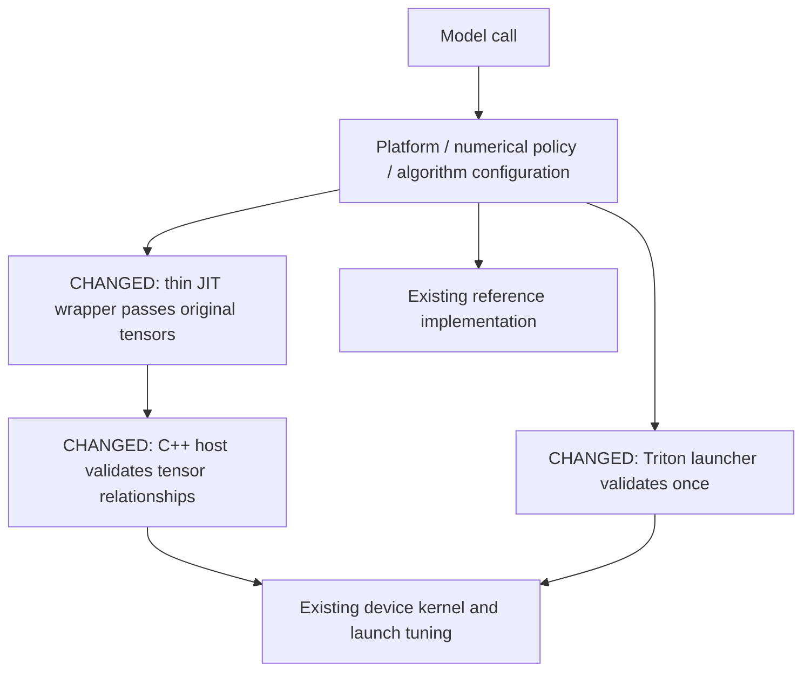

## Motivation

Diffusion model code repeatedly scans tensor ranks, shapes, dtypes, devices and strides through `can_use_*` predicates before calling launchers that need the same information. Flattening tensors before native validation also hides errors such as swapped batch/sequence dimensions with the same element count. After #42240, residual-gate still retains unreachable alternative implementations.

## Modifications

- Remove 18 tensor capability predicates across RoPE, activation, conditioning, normalization and QKV layout. Narrow five selectors to algorithm configuration: dtype, reduction/head width and hardware capability.
- Validate original tensor dimensions in the C++ launchers for Helios RoPE, SANA FP64 RoPE, LTX-2.5 decoder RoPE, GELU+cat and VDN delta factors. Triton launchers own their input validation.
- Let Qwen native QKNorm/RoPE consume packed projection views through its existing stride-aware device implementation. Validate the complex cache rank and vector alignment in C++. Keep the first-use reference comparison independent of the candidate.
- Keep contiguous residual-gate on JIT CUDA and transposed-dense residual-gate on its tuned Triton implementation. Delete unused kernels and catch-all failure caches. Retain numerical gates, request quality, autograd/compile policy and algorithm-specific fallbacks.
- Let Ideogram pass original 4D cos/sin tables into the RoPE launcher; remove its duplicate tensor scan and flattening while retaining unsupported-layout fallback.
- Select CPU/CUDA from the actual input device. A CPU call must not enter a CUDA launcher and permanently disable a process-wide GPU fusion gate; existing Wan tests reproduce the regression before this fix and pass afterward.
- Preserve device arithmetic and launch tuning; Helios additionally instantiates its existing arithmetic for FP32. Document the selection/validation boundary in the diffusion kernel README.

The paired Helios kernel requires matching Q/K heads and full per-token frequency tables, as produced by the attention module. Unsupported direct kernel inputs now raise before launch; the generic eager helper's arbitrary broadcasting is not a paired-kernel contract. TP RMSNorm retains the separate reference path.

This is a broad launcher cleanup, not a deletion of all backend selectors. Quantization formats, channels-last algorithms, numerical/quality policy and non-NVIDIA implementations retain their own selection. The [expanded design, remaining audit items and reproducible evidence](https://github.com/BBuf/sglang/tree/bbuf/diffusion-kernel-cleanup-evidence-20261003/v2) describe the boundaries explicitly.

## Accuracy Tests

Final head: `290c078825`. Baseline: `5916999afbc`. Dedicated B200, PyTorch 2.13.0+cu130, Triton 3.7.1.

| Validation | Baseline | Final head |
| --- | ---: | ---: |
| Full diffusion kernel directory + namespace | 3002 passed, 89 skipped, 4 failed | **3011 passed, 89 skipped, the same 4 failures** |

Both runs pass 40 subtests. The failures are the existing Ernie QKNorm/RoPE gate verification and three split-rounding/full-width NeoX/packed-KV cases in `test_rope.py`, reproduced on baseline in this environment.

- Existing Ideogram, Ernie RoPE/GeGLU and Wan model tests: **11 passed**.
- Ideogram fullgraph compilation and CUDA Graph replay with replacement inputs: passed for both tested shapes, including B=2.
- 84 cold-L2 workloads plus 7 additional model helpers: output bytes, shapes and strides match baseline in every A/B repetition.
- The previous CPU-fix revision `88882677ee` passed the full model-unit CI (3787 passed, 134 skipped, 3 xfailed, 351 subtests). Its local run additionally executes one sparse-attention ragged-tail case that fails with NaN; the same failure reproduces in the unchanged baseline. The final two-file Ideogram change is covered by the tests/benchmarks above and fresh CI.

Validation found and fixed two PR regressions: a CPU call disabling Wan's process-wide CUDA fusion gate, and Ideogram performing model-side checks plus the new launcher checks. No input-legality tests were added. Existing numerical, layout, graph, compilation and backend-selection coverage is retained.

[Full cold-L2 report, source manifests, raw samples, profiling evidence and reproduction scripts](https://github.com/BBuf/sglang/tree/bbuf/diffusion-kernel-cleanup-evidence-20261003/v3-cold-l2). [Final-head lint](https://github.com/sgl-project/sglang/actions/runs/37139994854) passed; [final-head CI](https://github.com/sgl-project/sglang/actions/runs/37139995184) is enabled and running.

CI is not all green: the [4-GPU JIT job](https://github.com/sgl-project/sglang/actions/runs/37139995184/job/111252444845) failed in the unchanged DSV4.1 sparse-indexer overlap test (501 vs required 501.76). Its test and attention code are unchanged by this PR; this failure has not been baseline-reproduced. GitHub rejected a job-only rerun while the parent workflow remains active. Final-head B200/5090 diffusion and component-accuracy jobs have passed.

## Speed Tests and Profiling

Before **every measured invocation**, read/write a **632.5 MiB buffer (5x the reported 126.5 MiB L2)**. Input reset and eviction are excluded from timing. Fixed seed, A/B/B/A process order, 10 warmups and 100 measurements per workload. Ordinary CUDA events measure queued GPU work; a separate eager wall-time measurement includes Python/C++ dispatch and synchronization. Empty timing controls and all raw samples are retained.

- **72 kernel/attention-entry cases:** GPU interval changes **-4.62% to +0.46%, geometric mean -0.19%**. No reproducible device-kernel regression observed.
- **12 Qwen/GLM/Ernie/Wan model helpers:** eager changes **-78.25% to +2.08%**, with a maximum increase of **0.82 us**. Packed Qwen projections benefit from the existing native stride-aware implementation.
- **7 additional Ernie/Ideogram/Sensenova helpers:** eager changes **-7.33% to -0.91%**. Ideogram's duplicate-validation regression previously added about 5.6 us; the final implementation no longer reproduces it.

Bare Triton launcher calls now include checks previously paid by their callers: those eager microbenchmarks can add **2–6 us**. Actual model-helper comparisons include both the old caller checks and the new launcher checks. This is not a claim of zero host overhead for every direct API call or of full-model throughput improvement.

External CUDA Graph event timing showed capture-dependent ~2 us shifts on some tiny operations. Same-revision recaptures, ordinary events and Nsight kernel durations were used to investigate; unfavorable raw runs remain in the report. The four small-kernel profiler medians differ by 0–32 ns. Final-head FP16 residual profiles confirm the same CUDA broadcast kernel/grid, with medians 5216→5216 ns and 31648→31680 ns.

The source comparison confirms 36 retained device definitions unchanged (normalizing only Helios' FP32 type assertion); five deleted definitions belong to dead residual-gate alternatives. These measurements cover the listed B200 shapes and helpers, not every architecture/input or multi-GPU/model configuration. Earlier rotating-input benchmarks are archived as historical data: their capped rotation count did not guarantee cold L2 for small cases.

## Checklist

- [x] Changed-file pre-commit hooks.
- [x] Registered GPU regression tests.
- [x] Kernel entry-point documentation.
- [x] Reproducible accuracy/performance evidence with coverage limits.
